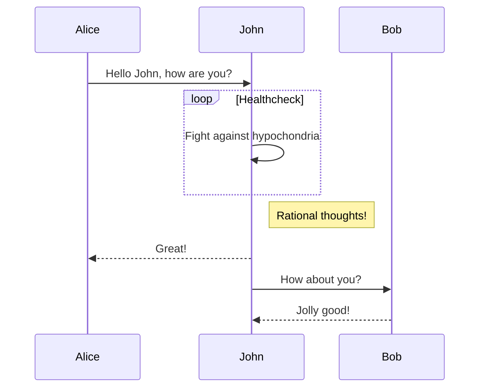

## Sequence diagram [<a href="http://mermaid-js.github.io/mermaid/#/sequenceDiagram">docs</a> - <a href="https://mermaidjs.github.io/mermaid-live-editor/#/edit/eyJjb2RlIjoic2VxdWVuY2VEaWFncmFtXG5BbGljZS0-PkpvaG46IEhlbGxvIEpvaG4sIGhvdyBhcmUgeW91P1xubG9vcCBIZWFsdGhjaGVja1xuICAgIEpvaG4tPj5Kb2huOiBGaWdodCBhZ2FpbnN0IGh5cG9jaG9uZHJpYVxuZW5kXG5Ob3RlIHJpZ2h0IG9mIEpvaG46IFJhdGlvbmFsIHRob3VnaHRzIVxuSm9obi0tPj5BbGljZTogR3JlYXQhXG5Kb2huLT4-Qm9iOiBIb3cgYWJvdXQgeW91P1xuQm9iLS0-PkpvaG46IEpvbGx5IGdvb2QhIiwibWVybWFpZCI6eyJ0aGVtZSI6ImRlZmF1bHQifX0">live editor</a>]

```
sequenceDiagram
Alice->>John: Hello John, how are you?
loop Healthcheck
    John->>John: Fight against hypochondria
end
Note right of John: Rational thoughts!
John-->>Alice: Great!
John->>Bob: How about you?
Bob-->>John: Jolly good!
```

